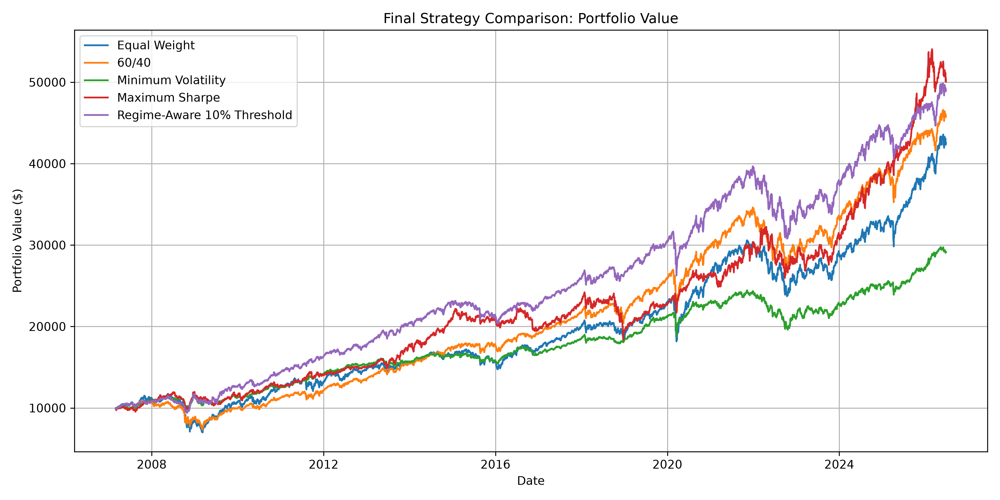
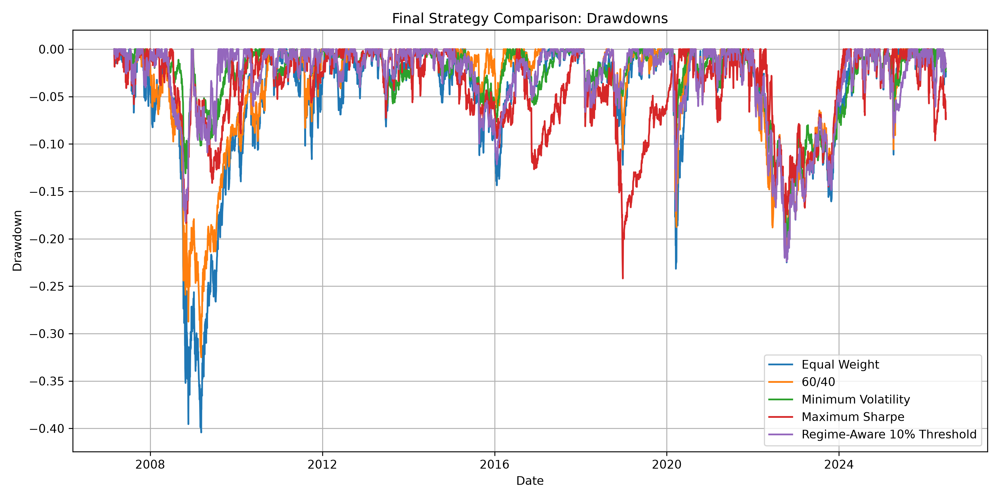
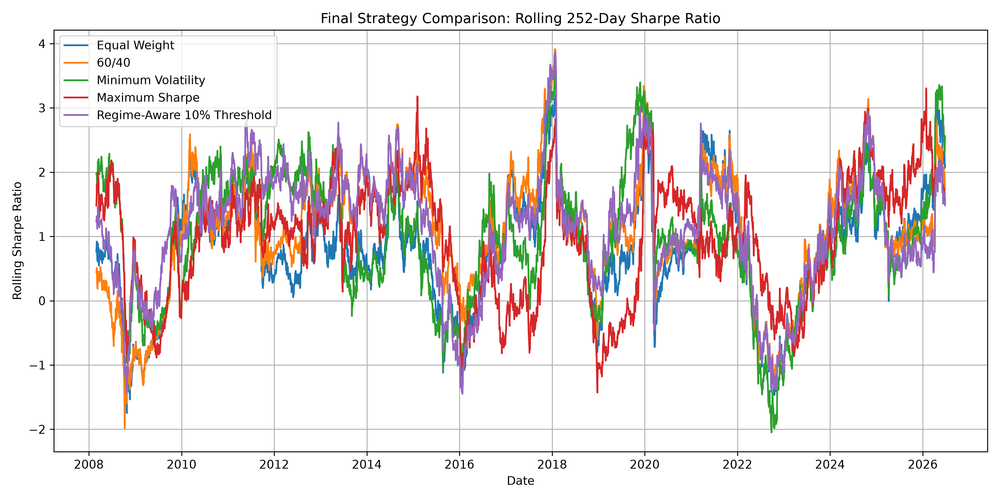
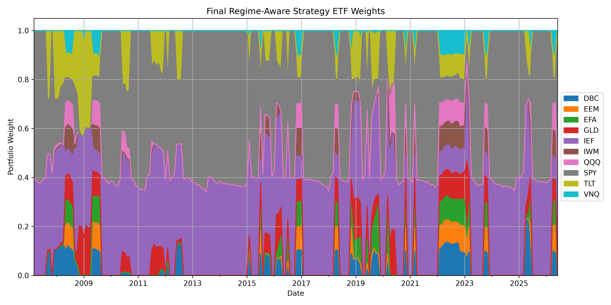

# Regime-Aware Portfolio Optimization Under Macroeconomic Uncertainty

## Overview

This project builds and evaluates a regime-aware ETF portfolio optimization system that adapts portfolio allocation based on changing market environments.

Most static portfolios rely on fixed allocations or historical return assumptions. However, financial markets behave differently during risk-on growth periods, volatility shocks, inflation-like regimes, and defensive transition periods. A portfolio that performs well in one regime may perform poorly in another.

This project asks:

> Can a regime-aware portfolio strategy improve risk-adjusted returns compared with static and optimization-based portfolio strategies?

The final system detects market regimes using ETF-based market features, selects portfolio logic based on the previous month's regime, applies turnover controls, and backtests performance with transaction costs.

---

## Project Objectives

The main goals of this project are to:

* Build a realistic ETF portfolio backtesting engine.
* Compare static and optimization-based portfolio strategies.
* Detect historical market regimes using unsupervised learning.
* Analyze which strategy performs best in each regime.
* Build a regime-aware strategy that adapts allocation by market environment.
* Evaluate robustness under transaction costs and turnover constraints.
* Produce research-style results suitable for GitHub, interviews, and graduate research discussions.

---

## Asset Universe

The project uses a diversified ETF universe across equities, bonds, commodities, gold, real estate, and international markets.

| Ticker | Asset Class                       |
| ------ | --------------------------------- |
| SPY    | U.S. large-cap equities           |
| QQQ    | U.S. growth / technology equities |
| IWM    | U.S. small-cap equities           |
| EFA    | Developed international equities  |
| EEM    | Emerging market equities          |
| TLT    | Long-term U.S. Treasuries         |
| IEF    | Intermediate-term U.S. Treasuries |
| GLD    | Gold                              |
| VNQ    | Real estate                       |
| DBC    | Commodities                       |

---

## Strategies Tested

The project compares five portfolio strategies.

### 1. Equal Weight

Allocates equally across all ETFs.

### 2. 60/40 Portfolio

Traditional benchmark portfolio:

* 60% SPY
* 40% IEF

### 3. Minimum Volatility Portfolio

Uses a rolling 252-day covariance matrix to find the long-only portfolio with the lowest estimated volatility.

### 4. Maximum Sharpe Portfolio

Uses rolling historical returns and covariance estimates to find the long-only portfolio with the highest estimated Sharpe ratio.

### 5. Regime-Aware 10% Threshold Strategy

The final strategy.

It uses the previous month's detected market regime to select a portfolio strategy:

| Previous Month Regime | Market Environment                       | Selected Strategy  |
| --------------------- | ---------------------------------------- | ------------------ |
| Regime 0              | Equity growth / risk-on                  | 60/40              |
| Regime 1              | Stress / high-volatility equity weakness | Maximum Sharpe     |
| Regime 2              | Mixed / transition regime                | Minimum Volatility |
| Regime 3              | Commodity strength / inflation-like      | Equal Weight       |

The final strategy rebalances monthly but only executes a rebalance when proposed turnover is at least 10%.

---

## Market Regime Detection

Market regimes are detected using K-Means clustering on monthly ETF-based features.

Features include:

* SPY 3-month, 6-month, and 12-month returns
* QQQ 3-month return
* IEF and TLT bond momentum
* GLD gold momentum
* DBC commodity momentum
* Equity-bond return spread
* Commodity-equity return spread
* SPY and QQQ rolling volatility
* Basket-level volatility
* SPY/TLT rolling correlation
* SPY drawdown

The model identified four regimes:

| Regime | Description                              |
| ------ | ---------------------------------------- |
| 0      | Equity growth / risk-on                  |
| 1      | Stress / high-volatility equity weakness |
| 2      | Mixed / transition regime                |
| 3      | Commodity strength / inflation-like      |

---

## Final Results

The final selected strategy is:

> **Regime-Aware 10% Threshold**

Assumptions:

* Starting portfolio value: $10,000
* Transaction cost: 10 bps per dollar traded
* Rebalance frequency: monthly
* Turnover threshold: 10%
* Lookback window for optimization: 252 trading days

| Strategy                   | Final Value |  CAGR | Volatility | Sharpe Ratio | Max Drawdown | Transaction Costs |
| -------------------------- | ----------: | ----: | ---------: | -----------: | -----------: | ----------------: |
| Equal Weight               |  $42,557.43 | 7.85% |     13.79% |         0.61 |      -40.43% |                 — |
| 60/40                      |  $45,890.53 | 8.24% |     11.05% |         0.77 |      -32.50% |                 — |
| Minimum Volatility         |  $29,146.45 | 5.70% |      6.88% |         0.84 |      -19.80% |                 — |
| Maximum Sharpe             |  $50,075.32 | 8.75% |     10.61% |         0.84 |      -24.18% |                 — |
| Regime-Aware 10% Threshold |  $49,075.73 | 8.62% |      9.22% |         0.94 |      -22.40% |         $1,727.23 |

---

## Key Findings

The Maximum Sharpe strategy produced the highest final portfolio value, but it came with higher volatility and a weaker Sharpe ratio than the final regime-aware strategy.

The Regime-Aware 10% Threshold strategy delivered the best risk-adjusted performance:

* Sharpe ratio: 0.94
* Volatility: 9.22%
* Max drawdown: -22.40%
* CAGR: 8.62%

The final result shows that regime-aware allocation can improve the balance between return, volatility, and drawdown control.

The main tradeoff is that regime-aware switching introduces higher turnover and transaction costs. Adding a 10% turnover threshold improved the strategy by reducing unnecessary rebalancing.

---

## Visual Results

### Portfolio Value Comparison



### Drawdown Comparison



### Rolling Sharpe Ratio



### Final Regime-Aware ETF Weights



---

## Transaction Cost Sensitivity

The regime-aware strategy was tested under different transaction cost assumptions.

| Transaction Cost | Final Value |  CAGR | Volatility | Sharpe Ratio | Max Drawdown |
| ---------------: | ----------: | ----: | ---------: | -----------: | -----------: |
|            0 bps |  $51,498.37 | 8.89% |      9.14% |         0.98 |      -22.47% |
|            5 bps |  $49,799.19 | 8.70% |      9.13% |         0.96 |      -22.54% |
|           10 bps |  $48,155.14 | 8.51% |      9.13% |         0.94 |      -22.62% |
|           25 bps |  $43,536.42 | 7.95% |      9.13% |         0.88 |      -22.83% |
|           50 bps |  $36,787.41 | 7.01% |      9.16% |         0.78 |      -23.19% |

The results show that the regime-aware strategy remains strong at low-to-moderate transaction costs, but high trading costs can materially reduce its return advantage.

---

## Turnover Control Experiment

Several turnover-control rules were tested:

| Experiment                   | Final Value |  CAGR | Sharpe Ratio | Max Drawdown | Transaction Costs |
| ---------------------------- | ----------: | ----: | -----------: | -----------: | ----------------: |
| Monthly Base                 |  $48,038.31 | 8.48% |         0.94 |      -22.62% |         $1,775.81 |
| Monthly 5% Threshold         |  $48,739.57 | 8.56% |         0.94 |      -22.62% |         $1,759.89 |
| Monthly 10% Threshold        |  $48,956.67 | 8.58% |         0.94 |      -22.40% |         $1,737.23 |
| Monthly 20% Threshold        |  $49,085.91 | 8.60% |         0.93 |      -22.40% |         $1,730.56 |
| Quarterly Base               |  $40,877.41 | 7.57% |         0.81 |      -24.23% |           $885.95 |
| Monthly 2-Month Confirmation |  $36,621.24 | 6.96% |         0.73 |      -23.55% |           $870.28 |

The monthly 10% threshold rule was selected because it provided the best balance of Sharpe ratio, drawdown control, final value, and turnover reduction.

---

## Project Structure

```text
regime-aware-portfolio-optimizer/
│
├── README.md
├── requirements.txt
│
├── data/
│   └── processed/
│
├── figures/
│   ├── final_assets/
│   └── ...
│
├── reports/
│   └── final_assets/
│
└── src/
    ├── analysis/
    │   ├── final_report_assets.py
    │   ├── strategy_performance_by_regime.py
    │   ├── transaction_cost_sensitivity.py
    │   └── turnover_control_experiment.py
    │
    ├── backtest/
    │   ├── engine.py
    │   ├── metrics.py
    │   ├── run_baseline_backtest.py
    │   ├── run_optimized_backtest.py
    │   ├── run_regime_aware_backtest.py
    │   └── run_true_regime_aware_backtest.py
    │
    ├── data/
    │   └── fetch_prices.py
    │
    ├── features/
    │   └── build_market_features.py
    │
    └── models/
        ├── optimizer.py
        └── regime_model.py
```

---

## How to Run the Project

### 1. Clone the repository

```bash
git clone <your-repository-url>
cd regime-aware-portfolio-optimizer
```

### 2. Create a virtual environment

```bash
python3 -m venv .venv
source .venv/bin/activate
```

### 3. Install dependencies

```bash
pip install -r requirements.txt
```

### 4. Download ETF price data

```bash
python src/data/fetch_prices.py
```

### 5. Run baseline backtest

```bash
python src/backtest/run_baseline_backtest.py
```

### 6. Run optimized strategy backtest

```bash
python src/backtest/run_optimized_backtest.py
```

### 7. Run market regime detection

```bash
python src/backtest/run_regime_detection.py
```

### 8. Run strategy performance by regime

```bash
python src/analysis/strategy_performance_by_regime.py
```

### 9. Run true regime-aware strategy backtest

```bash
python src/backtest/run_true_regime_aware_backtest.py
```

### 10. Run transaction cost sensitivity analysis

```bash
python src/analysis/transaction_cost_sensitivity.py
```

### 11. Run turnover control experiment

```bash
python src/analysis/turnover_control_experiment.py
```

### 12. Generate final report assets

```bash
python src/analysis/final_report_assets.py
```

---

## Methodology Summary

The project follows this workflow:

1. Download ETF price data.
2. Calculate daily returns.
3. Build static benchmark strategies.
4. Build rolling optimization strategies.
5. Engineer market regime features.
6. Detect regimes using K-Means clustering.
7. Analyze strategy performance by regime.
8. Build a regime-aware strategy using previous-month regime signals.
9. Add ETF-level rebalancing and transaction costs.
10. Run transaction cost sensitivity tests.
11. Add turnover-control rules.
12. Generate final charts and report assets.

---

## Limitations

This project is intended for research and educational purposes. It is not financial advice.

Important limitations:

* K-Means regime labels are exploratory and fitted on historical data.
* The regime model is not fully walk-forward or expanding-window validated yet.
* ETF price data is sourced through public market data APIs and may not be suitable for production trading.
* Taxes, bid-ask spreads, liquidity constraints, slippage, and market impact are simplified.
* Expected returns for Maximum Sharpe optimization are noisy and may overfit recent winners.
* The strategy does not include short selling, leverage, options, or dynamic cash allocation.
* Transaction costs are modeled as a simple basis-point cost per dollar traded.

---

## Future Work

Potential improvements:

* Build a fully walk-forward regime detection model.
* Add expanding-window K-Means or Hidden Markov Models.
* Add macroeconomic data such as CPI, unemployment, Fed Funds Rate, and yield curve spreads.
* Add inflation-protected assets such as TIP and short-duration Treasury ETFs.
* Add sector ETFs such as XLE, XLK, XLF, and XLV.
* Add slippage and bid-ask spread modeling.
* Add downside-risk optimization using CVaR.
* Build a Streamlit dashboard.
* Convert the final analysis into a research paper or technical report.

---

## Final Takeaway

The final regime-aware strategy did not maximize raw ending wealth, but it produced the strongest risk-adjusted profile.

The key conclusion is:

> A regime-aware portfolio strategy can improve the balance between return, volatility, and drawdown control, but its performance depends heavily on turnover management and transaction costs.

This project demonstrates a practical application of financial analytics, portfolio optimization, market regime detection, and risk-aware decision-making.
