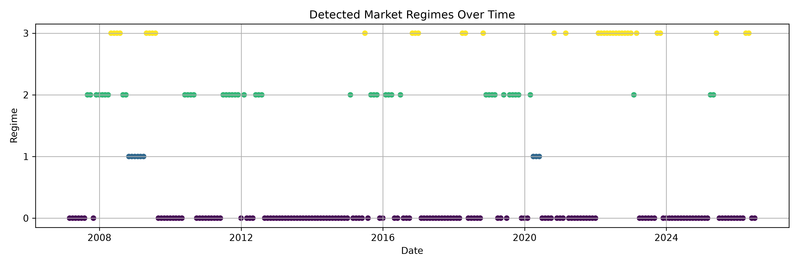

# Regime-Aware Portfolio Optimization Under Macroeconomic Uncertainty

## Abstract

This project investigates whether a regime-aware ETF allocation strategy can improve risk-adjusted portfolio performance compared with static and optimization-based benchmark strategies. Using a diversified ETF universe across equities, bonds, commodities, gold, real estate, and international markets, the project builds a full backtesting pipeline that includes data collection, portfolio optimization, market regime detection, transaction cost modeling, turnover control, and final performance evaluation.

The study compares Equal Weight, 60/40, Minimum Volatility, Maximum Sharpe, and a final Regime-Aware 10% Threshold strategy. Market regimes are detected using K-Means clustering on ETF-based momentum, volatility, correlation, spread, and drawdown features. The final regime-aware strategy uses the previous month's detected regime to select the appropriate portfolio logic and applies a 10% turnover threshold to reduce unnecessary rebalancing.

The results show that the Maximum Sharpe strategy produced the highest final portfolio value, while the final Regime-Aware 10% Threshold strategy produced the strongest risk-adjusted profile. The final regime-aware strategy achieved a CAGR of 8.62%, volatility of 9.22%, Sharpe ratio of 0.94, and maximum drawdown of -22.40%. The main finding is that regime-aware allocation can improve the balance between return, volatility, and drawdown control, but its performance depends heavily on transaction costs and turnover management.

---

## 1. Introduction

Portfolio allocation is one of the central problems in finance. Investors must decide how to distribute capital across assets while balancing return, risk, drawdown, and trading costs. Traditional approaches such as Equal Weight or 60/40 portfolios are simple and robust, but they do not adapt to changing market environments. Optimization-based approaches, such as Minimum Volatility and Maximum Sharpe portfolios, use historical return and covariance estimates to improve allocation, but they can be unstable and sensitive to noisy data.

Financial markets do not behave the same way across time. Equity growth periods, crisis periods, inflation-like commodity regimes, and defensive transition environments can produce very different asset behavior. A strategy that performs well in one regime may perform poorly in another.

This project asks:

> Can a regime-aware portfolio strategy improve risk-adjusted performance compared with static and optimization-based portfolio strategies?

To answer this, the project builds a complete research-style pipeline:

1. Download ETF price data.
2. Construct baseline portfolio strategies.
3. Build rolling optimization strategies.
4. Engineer market regime features.
5. Detect regimes using K-Means clustering.
6. Analyze strategy performance by regime.
7. Build a regime-aware ETF allocation strategy.
8. Add transaction costs and turnover controls.
9. Evaluate final strategy performance.
10. Generate final report assets and visualizations.

---

## 2. Research Question

The primary research question is:

> Does a regime-aware ETF portfolio strategy improve risk-adjusted performance relative to Equal Weight, 60/40, Minimum Volatility, and Maximum Sharpe strategies?

The secondary research questions are:

1. Which portfolio strategy performs best in each market regime?
2. Does regime-aware allocation reduce volatility and drawdowns?
3. How sensitive is the regime-aware strategy to transaction costs?
4. Can turnover controls improve the performance of a dynamic strategy?
5. Does the strategy maximize raw returns, or does it mainly improve risk-adjusted performance?

---

## 3. Data

The project uses a diversified ETF universe representing major asset classes.

| Ticker | Asset Class                       |
| ------ | --------------------------------- |
| SPY    | U.S. large-cap equities           |
| QQQ    | U.S. growth / technology equities |
| IWM    | U.S. small-cap equities           |
| EFA    | Developed international equities  |
| EEM    | Emerging market equities          |
| TLT    | Long-term U.S. Treasuries         |
| IEF    | Intermediate-term U.S. Treasuries |
| GLD    | Gold                              |
| VNQ    | Real estate                       |
| DBC    | Commodities                       |

The ETF universe was selected to create a multi-asset allocation problem rather than a single-equity forecasting problem. It includes growth assets, defensive assets, inflation-sensitive assets, and international exposure.

The project uses adjusted ETF prices and calculates daily returns. Monthly data is used for market regime detection and regime-level strategy analysis.

---

## 4. Portfolio Strategies

Five strategies are evaluated.

### 4.1 Equal Weight

The Equal Weight strategy allocates equally across all ETFs in the universe. This strategy serves as a simple diversified benchmark.

### 4.2 60/40 Portfolio

The 60/40 strategy allocates:

* 60% to SPY
* 40% to IEF

This represents a traditional equity/bond benchmark.

### 4.3 Minimum Volatility Portfolio

The Minimum Volatility strategy uses a rolling 252-trading-day lookback window to estimate the covariance matrix of asset returns. It then solves for the long-only portfolio with the lowest estimated volatility.

Constraints:

* Long-only weights
* Maximum asset weight of 40%
* Monthly rebalancing
* Transaction costs applied per dollar traded

### 4.4 Maximum Sharpe Portfolio

The Maximum Sharpe strategy uses a rolling 252-trading-day lookback window to estimate expected returns and the covariance matrix. It then solves for the long-only portfolio with the highest estimated Sharpe ratio.

Constraints:

* Long-only weights
* Maximum asset weight of 40%
* Annual risk-free rate assumption of 2%
* Monthly rebalancing
* Transaction costs applied per dollar traded

### 4.5 Regime-Aware 10% Threshold Strategy

The final strategy uses the previous month's detected market regime to choose the portfolio logic for the current month.

| Previous Month Regime | Market Environment                       | Selected Strategy  |
| --------------------- | ---------------------------------------- | ------------------ |
| Regime 0              | Equity growth / risk-on                  | 60/40              |
| Regime 1              | Stress / high-volatility equity weakness | Maximum Sharpe     |
| Regime 2              | Mixed / transition regime                | Minimum Volatility |
| Regime 3              | Commodity strength / inflation-like      | Equal Weight       |

The final strategy rebalances monthly, but only executes a rebalance if proposed turnover is at least 10%. This threshold is designed to reduce unnecessary trades and lower transaction costs.

---

## 5. Market Regime Detection

Market regimes are detected using K-Means clustering on monthly ETF-based features.

The features include:

* SPY 3-month return
* SPY 6-month return
* SPY 12-month return
* QQQ 3-month return
* IEF 3-month return
* TLT 3-month return
* GLD 3-month return
* DBC 3-month return
* Equity-bond 3-month spread
* Commodity-equity 3-month spread
* SPY 3-month volatility
* QQQ 3-month volatility
* Basket-level 3-month volatility
* SPY/TLT 3-month correlation
* SPY drawdown

The regime model identified four historical market environments.

| Regime | Description                              |
| ------ | ---------------------------------------- |
| 0      | Equity growth / risk-on                  |
| 1      | Stress / high-volatility equity weakness |
| 2      | Mixed / transition regime                |
| 3      | Commodity strength / inflation-like      |

The detected market regimes are shown below.

---

## 6. Backtesting Design

The backtest starts with an initial portfolio value of $10,000.

Core assumptions:

| Assumption                            | Value                    |
| ------------------------------------- | ------------------------ |
| Starting portfolio value              | $10,000                  |
| Base transaction cost                 | 10 bps per dollar traded |
| Rebalance frequency                   | Monthly                  |
| Optimization lookback window          | 252 trading days         |
| Minimum observations for optimization | 60 trading days          |
| Weighting constraints                 | Long-only                |
| Maximum single-asset weight           | 40%                      |
| Final turnover threshold              | 10%                      |

The project progressively improves realism across several stages:

1. Basic portfolio returns
2. Monthly rebalancing
3. Transaction costs
4. Rolling optimization
5. Regime detection
6. Strategy performance by regime
7. Regime-aware return stream
8. True ETF-level regime-aware allocation
9. Transaction cost sensitivity
10. Turnover control

The final regime-aware strategy uses actual ETF weights, lets portfolio weights drift daily, rebalances monthly, and pays transaction costs based on realized turnover.

---

## 7. Strategy Performance by Regime

The project evaluates which strategy performs best in each detected regime.

| Regime | Market Environment                       | Best Strategy      |
| ------ | ---------------------------------------- | ------------------ |
| 0      | Equity growth / risk-on                  | 60/40              |
| 1      | Stress / high-volatility equity weakness | Maximum Sharpe     |
| 2      | Mixed / transition regime                | Minimum Volatility |
| 3      | Commodity strength / inflation-like      | Equal Weight       |

This regime-level analysis forms the decision rule for the regime-aware allocation system.

The result suggests that no single strategy is universally superior. Different market environments reward different portfolio construction methods.

---

## 8. Final Results

The final selected strategy is:

> Regime-Aware 10% Threshold

The final performance comparison is shown below.

| Strategy                   | Final Value |  CAGR | Volatility | Sharpe Ratio | Max Drawdown | Transaction Costs |
| -------------------------- | ----------: | ----: | ---------: | -----------: | -----------: | ----------------: |
| Equal Weight               |  $42,557.43 | 7.85% |     13.79% |         0.61 |      -40.43% |                 — |
| 60/40                      |  $45,890.53 | 8.24% |     11.05% |         0.77 |      -32.50% |                 — |
| Minimum Volatility         |  $29,146.45 | 5.70% |      6.88% |         0.84 |      -19.80% |                 — |
| Maximum Sharpe             |  $50,075.32 | 8.75% |     10.61% |         0.84 |      -24.18% |                 — |
| Regime-Aware 10% Threshold |  $49,075.73 | 8.62% |      9.22% |         0.94 |      -22.40% |         $1,727.23 |

The Maximum Sharpe strategy produced the highest final portfolio value. However, the Regime-Aware 10% Threshold strategy produced the best Sharpe ratio and a stronger overall risk-adjusted profile.

---

## 9. Visual Results

### 9.1 Portfolio Value Comparison

The portfolio value chart shows that Maximum Sharpe achieved the highest ending value, while the Regime-Aware 10% Threshold strategy remained competitive with lower volatility.

### 9.2 Drawdown Comparison

The drawdown chart shows that the regime-aware strategy reduced downside risk compared with Equal Weight, 60/40, and Maximum Sharpe. Minimum Volatility had the lowest drawdown but also the weakest long-term growth.

### 9.3 Rolling Sharpe Ratio

The rolling Sharpe chart shows how risk-adjusted performance changed over time. The regime-aware strategy provides a more balanced performance profile compared with strategies that are more concentrated in either growth or risk reduction.

### 9.4 Regime-Aware ETF Weights

The ETF weights chart shows how the final strategy changes allocation over time based on detected market environments and turnover-control rules.

---

## 10. Transaction Cost Sensitivity

The regime-aware strategy was tested under multiple transaction cost assumptions.

| Transaction Cost | Final Value |  CAGR | Volatility | Sharpe Ratio | Max Drawdown |
| ---------------: | ----------: | ----: | ---------: | -----------: | -----------: |
|            0 bps |  $51,498.37 | 8.89% |      9.14% |         0.98 |      -22.47% |
|            5 bps |  $49,799.19 | 8.70% |      9.13% |         0.96 |      -22.54% |
|           10 bps |  $48,155.14 | 8.51% |      9.13% |         0.94 |      -22.62% |
|           25 bps |  $43,536.42 | 7.95% |      9.13% |         0.88 |      -22.83% |
|           50 bps |  $36,787.41 | 7.01% |      9.16% |         0.78 |      -23.19% |

The results show that the regime-aware strategy remains strong at low-to-moderate transaction costs. However, high transaction costs materially reduce its return advantage. This confirms that turnover management is essential for dynamic allocation strategies.

---

## 11. Turnover Control Experiment

The project tested several turnover-control approaches.

| Experiment                   | Final Value |  CAGR | Sharpe Ratio | Max Drawdown | Transaction Costs |
| ---------------------------- | ----------: | ----: | -----------: | -----------: | ----------------: |
| Monthly Base                 |  $48,038.31 | 8.48% |         0.94 |      -22.62% |         $1,775.81 |
| Monthly 5% Threshold         |  $48,739.57 | 8.56% |         0.94 |      -22.62% |         $1,759.89 |
| Monthly 10% Threshold        |  $48,956.67 | 8.58% |         0.94 |      -22.40% |         $1,737.23 |
| Monthly 20% Threshold        |  $49,085.91 | 8.60% |         0.93 |      -22.40% |         $1,730.56 |
| Quarterly Base               |  $40,877.41 | 7.57% |         0.81 |      -24.23% |           $885.95 |
| Monthly 2-Month Confirmation |  $36,621.24 | 6.96% |         0.73 |      -23.55% |           $870.28 |

The monthly 10% threshold was selected for the final strategy because it provides a strong balance of final value, Sharpe ratio, drawdown control, and transaction cost reduction.

The experiment also shows that quarterly rebalancing and two-month regime confirmation reduce trading costs but hurt performance by making the strategy less responsive.

---

## 12. Discussion

The results show that regime-aware allocation can improve risk-adjusted performance, but the benefit is not unlimited. The final strategy did not produce the highest raw ending wealth. Maximum Sharpe produced the highest final value, but it also had higher volatility and a lower Sharpe ratio.

The Regime-Aware 10% Threshold strategy offered a better balance:

| Metric       | Maximum Sharpe | Regime-Aware 10% Threshold |
| ------------ | -------------: | -------------------------: |
| Final Value  |     $50,075.32 |                 $49,075.73 |
| CAGR         |          8.75% |                      8.62% |
| Volatility   |         10.61% |                      9.22% |
| Sharpe Ratio |           0.84 |                       0.94 |
| Max Drawdown |        -24.18% |                    -22.40% |

This suggests that dynamic strategy selection can reduce risk without sacrificing too much return.

A key takeaway is that the best portfolio strategy depends on the market environment. In risk-on regimes, the 60/40 portfolio worked well. In transition regimes, Minimum Volatility performed better. In inflation-like commodity regimes, Equal Weight was the least damaging. During stress regimes, Maximum Sharpe performed best in the historical sample, although this result should be interpreted carefully because the stress-regime sample size was small.

---

## 13. Limitations

This project has several important limitations.

First, the market regime model is exploratory. K-Means clustering is fitted on historical data and is not yet implemented as a fully walk-forward or expanding-window regime model.

Second, the regime labels are based on ETF-derived features rather than direct macroeconomic variables. Future versions should include CPI, unemployment, interest rates, yield curve spreads, credit spreads, and recession indicators.

Third, transaction costs are simplified as a fixed basis-point cost per dollar traded. Real implementation would also require modeling bid-ask spreads, slippage, liquidity, taxes, and market impact.

Fourth, the Maximum Sharpe strategy uses historical average returns, which are noisy and can overfit recent winners.

Fifth, the strategy is long-only and does not include leverage, short selling, options, futures, or explicit cash allocation.

Finally, the project is for research and educational purposes only. It is not financial advice.

---

## 14. Future Work

Future improvements include:

1. Build a fully walk-forward regime detection model.
2. Add expanding-window K-Means to avoid full-sample regime fitting.
3. Test Hidden Markov Models for regime detection.
4. Add macroeconomic indicators such as CPI, unemployment, Fed Funds Rate, and yield curve spreads.
5. Add inflation-sensitive and defensive ETFs such as TIP, SHY, XLE, and UUP.
6. Add sector rotation analysis.
7. Add CVaR and downside-risk optimization.
8. Model bid-ask spreads and slippage.
9. Add tax-aware rebalancing.
10. Build a Streamlit dashboard.
11. Convert the project into a formal research paper.
12. Extend the framework to Indian markets using NSE ETFs or index data.

---

## 15. Conclusion

This project demonstrates a practical regime-aware portfolio optimization framework. It combines market regime detection, portfolio optimization, transaction cost modeling, turnover control, and performance evaluation.

The final Regime-Aware 10% Threshold strategy did not maximize raw ending wealth, but it produced the best risk-adjusted result among the tested strategies. It achieved a Sharpe ratio of 0.94, reduced volatility to 9.22%, and limited maximum drawdown to -22.40%, while maintaining a CAGR of 8.62%.

The main conclusion is:

> A regime-aware portfolio strategy can improve the balance between return, volatility, and drawdown control, but its performance depends heavily on turnover management and transaction costs.

This project provides a strong foundation for further research in financial optimization, market regime modeling, and adaptive portfolio construction.
